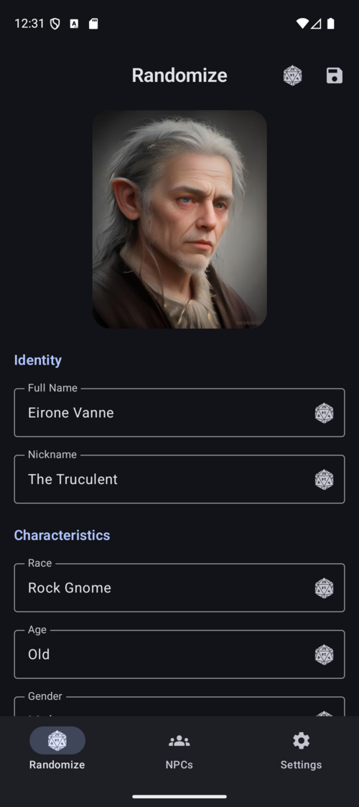
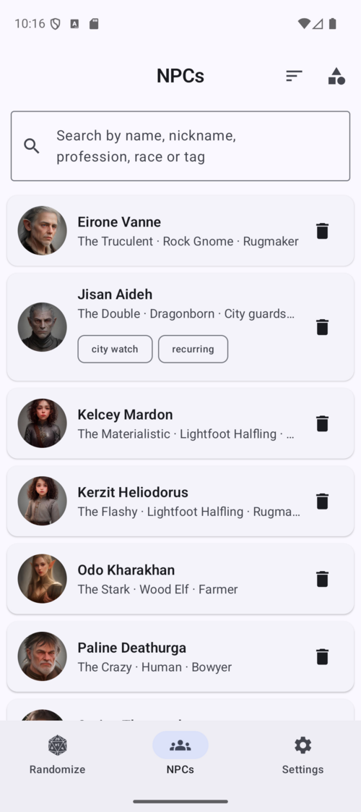
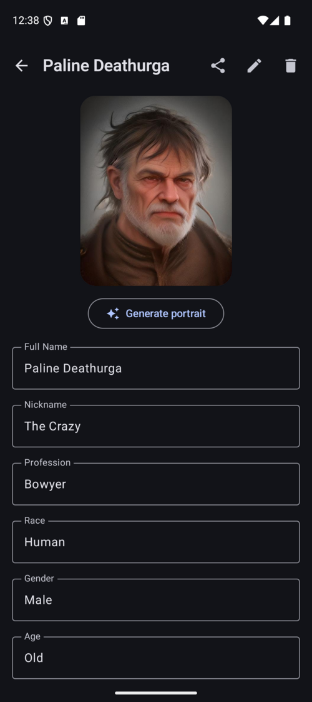
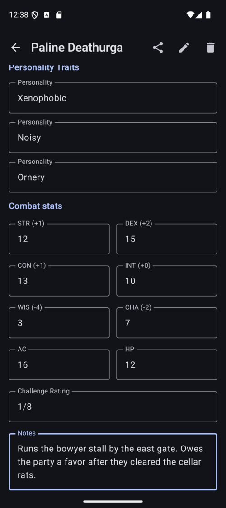
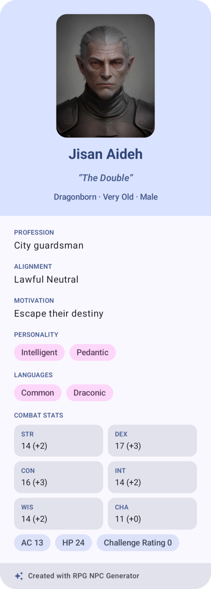
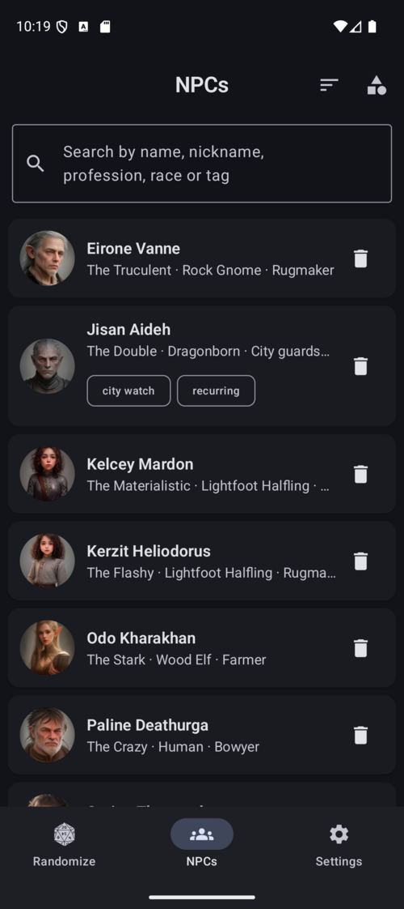
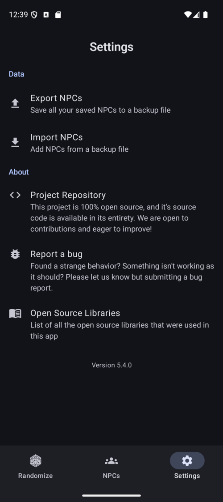

# RPG NPC Generator

[](https://github.com/LeoColman/rpg-npc-generator/blob/master/LICENSE)
[](https://github.com/LeoColman/rpg-npc-generator/actions/workflows/android-test.yml)
[](https://www.android.com/)
[](https://kotlinlang.org/)
[](https://developer.android.com/jetpack/compose)
[](https://developer.android.com/studio/releases/platforms)

**RPG NPC Generator** is an Android app that helps Dungeon Masters create
non-player characters for their tabletop campaigns — rolling up a believable NPC
in seconds, saving the ones worth keeping, and even generating a portrait to go
with them.

It aims to be easy yet powerful, so DMs can spend their creativity where it
matters and enrich their players' experience.

<a href='https://play.google.com/store/apps/details?id=me.kerooker.rpgcharactergenerator&pcampaignid=pcampaignidMKT-Other-global-all-co-prtnr-py-PartBadge-Mar2515-1'></a>

## Download

The app is distributed through three channels (F-Droid coming soon) — pick the one that matches how much usage data it sends back:

| Distribution | Contains | Get it |
| --- | --- | --- |
| **Google Play** | Ads + telemetry | [Play Store](https://play.google.com/store/apps/details?id=me.kerooker.rpgcharactergenerator) |
| **GitHub Releases** | Telemetry (no ads) | [Latest release](https://github.com/LeoColman/rpg-npc-generator/releases/latest) |
| **F-Droid** | None — fully FOSS | _coming soon_ |

_"Telemetry" is optional product analytics (PostHog) and crash reporting (self-hosted GlitchTip); see [Releasing & signing](#releasing--signing) for how each flavor is built._

## Screenshots

<table>
  <tr>
    <td align="center" width="25%"><br><sub><b>Roll &amp; portrait</b></sub></td>
    <td align="center" width="25%"><br><sub><b>Search, tags &amp; sort</b></sub></td>
    <td align="center" width="25%"><br><sub><b>NPC detail</b></sub></td>
    <td align="center" width="25%"><br><sub><b>Combat stats &amp; re-roll</b></sub></td>
  </tr>
  <tr>
    <td align="center" width="25%"><br><sub><b>PNG/PDF export</b></sub></td>
    <td align="center" width="25%"><br><sub><b>Dark mode</b></sub></td>
    <td align="center" width="25%"><br><sub><b>Backup &amp; restore</b></sub></td>
    <td width="25%"></td>
  </tr>
</table>

## Features

- **Randomize an NPC** — roll a complete D&D-flavoured character: race, age,
  gender, profession, alignment, personality, motivation, languages, name and
  nickname. Re-roll any single trait until it fits your scene.
- **AI portraits** — generate a fantasy portrait from the NPC's own traits,
  rendered on a self-hosted server and delivered in the background
  (see [`server/portrait-renderer`](server/portrait-renderer/README.md)).
- **Save & browse** — keep the NPCs you like and revisit them any time; search
  your roster by name, nickname, profession, race or tag, sort it your way, tag
  NPCs with your own labels, and group them by campaign. Each NPC keeps its
  attributes, notes and portrait.
- **Combat stats** — attach an optional D&D 5e stat block to any NPC: the six
  ability scores (with modifiers), armor class, hit points and challenge rating.
  Re-roll the whole block until it fits — without touching the portrait.
- **Share & export** — turn any saved NPC into a polished sheet and share it as
  a PNG image or a one-page PDF, portrait and stat block included.
- **Dark mode** — follow the system theme or force light/dark from Settings.
- **Backup & restore** — export your whole roster to a single file — portraits
  included — and import it back on any device.
- **Offline-first** — attribute generation and your saved roster work with no
  network; only portrait rendering reaches out.
- **Localised** — available in English and Portuguese.

## Tech stack

100% Kotlin. Jetpack Compose (Material 3) UI, SQLDelight persistence, Koin for
dependency injection, WorkManager for background portrait jobs and coil3 for
image loading. Business logic is tested with Kotest and UI components with
Robolectric; Detekt and Android Lint run in CI.

## Project structure

- **`:app`** — the Android application (`me.kerooker.rpgnpcgenerator`).
- **`:portrait-queue`** ([`server/portrait-renderer`](server/portrait-renderer/README.md))
  — a small Kotlin/Ktor FIFO queue fronting the CPU image renderer the app calls
  for portraits. Runs as a Docker Swarm stack and is not needed to build or run
  the app.

## Building & running

The app targets Android (minSdk 26, targetSdk 36) and builds with JDK 17+
(CI uses JDK 21).

```bash
./gradlew :app:assembleDebug    # build every flavor's debug APK
./gradlew :app:installFdroidDebug   # install the FOSS build on a device/emulator
./gradlew test                  # run the Kotest + Robolectric tests
```

### Distribution flavors

The app ships in three flavors on a single `distribution` dimension:

| Flavor      | Channel              | Ads | Analytics / crash | Signing        |
|-------------|----------------------|-----|-------------------|----------------|
| `fdroid`    | F-Droid              | ❌  | ❌                | F-Droid signs  |
| `github`    | GitHub direct APK    | ❌  | ✅                | release key    |
| `playstore` | Google Play          | ✅  | ✅                | release key    |

`fdroid` is fully FOSS: it compiles only `src/main` (no AdMob / PostHog / GlitchTip
on its classpath) and carries no signing config so F-Droid's buildserver signs it.
Analytics + crash live in `src/telemetry` (github + playstore); ads live in
`src/playstore`. Build a specific flavor with the usual per-flavor tasks, e.g.
`./gradlew assembleFdroidRelease`, `assembleGithubRelease`, `bundlePlaystoreRelease`
(release builds first need `git secret reveal` for the keystore).

Portrait generation talks to a server-side renderer
([`server/portrait-renderer`](server/portrait-renderer/README.md), open source and
self-hostable). Every flavor ships a baked default server, and the server (URL,
username, password) is editable in-app under **Settings → Portrait server**, so you
can point any build — including the F-Droid one — at your own instance. The baked
default password is set via `-PnpcImagePassword=<password>` (or the committed
`npcImageRealPassword` fallback); clearing it disables portraits.

## Contributing

Feel free to create an issue or open a PR for whatever you feel like. We're open to all sorts of discussions and improvements!

## Releasing & signing

Releases are automated — see [RELEASE.md](RELEASE.md). The signing keystore and the Google Play
service-account key are stored encrypted with [git-secret](https://sobolevn.me/git-secret/) and are
revealed in CI using a dedicated, project-only GPG key (no personal keys are used). That key's
**public** half is published below so anyone can inspect the recipient the secrets are encrypted to.

Release GPG public key — fingerprint `344F 705A AD16 71B7 094A E0BA AD7A B4BA 96BB BEB3`:

```
-----BEGIN PGP PUBLIC KEY BLOCK-----

mQINBGpP24EBEADweZMFBOY5idF4btud8WCqexq24iKl2iC/EP5QbYLMQvPjp/Oh
5gnaEkn64vUk28pBFbN8yCKfC+dQ1zsiEBoRWVnTKdkPlnz1IQ8znO34EkCHnlvt
r3hStee1VnnpxFsPz/ShGjB6Bw8PgraTazmLO5wEDOhqTbrLigBQOv2YfbBusqHE
TWhHgr7s05SpKFKri2VyRxHfoO0/POLaU3HoWqzjX1pzDDnUoIzAmZ/ZkUhjBtoS
C6ZKUJ42csoJbdfu7sQ2+zz40aljqIVVFiSa94lf5xC5bR/hzKrmNCthomaZF5DH
Ch4p1rY452awroOHtleKdibdQyZ5zRDSvFX3OYZmsEw/I4naHILTi/FHOKKjSBY7
O7/nnJMNeerm4PE3HiEYPp4SfgnAqKcVPzZjwBwMahprut36yPFb0H2GmBqix+jL
RPxO5lb3vIUObxyuFkvTjDvGDg6tEbqAtEPDZdke3N8oFUfNIXDgPGI1woTMay+f
vpV4sbQUrIUaqEwNgqB1RMmXoj02QkC4jZm4fURxvORRY6uwd05hDsJ36pfZjs7e
drvXrq6fwVUn+Qi8iDe/GskDMbQxE71ezemi0aJSLmMlRNaKBqil2/005Lef53AM
nNSfFrk2XJkdNuB264wMnGK36y78e7E2vUiPzQboyC02Vj1QSzkEXdWe3QARAQAB
tDdSUEcgTlBDIEdlbmVyYXRvciBSZWxlYXNlIDxyZWxlYXNlQHJwZ25wY2dlbmVy
YXRvci5hcHA+iQJuBBMBCABYFiEENE9wWq0WcbcJSuC6rXq0upa7vrMFAmpP24Eb
FIAAAAAABAAObWFudTIsMi41KzEuMTIsMCwyAxsvBAULCQgHAgIiAgYVCgkICwIE
FgIDAQIeBwIXgAAKCRCterS6lru+szetEADsnO6QJeLCinHrKr3FhpIICP0DaJst
LPvzI34jzE6lzBqDhQIf23Fa5X/t87Yepy+TZVXLMtDzg2k9DvrL7EnJxNoldBJX
e/ERATpTtiVpmCGic90bW5MVdx2j0At7/FlGqF7vpTFkslpiPYFNhRlVH8YMGcMe
bh9q/yx9wSRKM8Gf1knpb9+D/oNPqod7SYTOMUtWqX4Ym6BvPsYNXNR8BH06jjj6
qir5A0INADuHUjhPtN8UHwGR/ZI0l4fTvWCiemx5vwq3BoQJZDB03dQVAr6GgnvX
wru2Bd9hse6UhxKSTXW7RKksa226Qvo5ZuCUAy+ekCC96HhIhX2X2YTql56Ry3fu
9nX7TOB8weKttDwVViZ+DtWCh/qD/1ITwaTKz714tqFoiaOhpgYbkyu8oTdsWBvc
cQ1NgWZ52ihU/iSWurnm/vhRQYBrRT9QVWvn42gMgdtFo09lkzBS7297kM8siXs9
P/FdfZAuY0nKHrBJ47puUeBCPCnPA/TXICZvCTO49SnCg3TZpl4FMHDiRFHvSm6i
1GKvOgAdhUS3u5d97dobdOZOLTRNCbXNeQRcRZMbij31xcCnGIoM+MJm7BDe/iXt
WrkpVAwpPVomcuqKXvOpuvsipbcytkoOZGu5+gQ/E7u8aWSTt9GAe6XchuN65ZHN
ojD+C+gO6t2gyw==
=VUVq
-----END PGP PUBLIC KEY BLOCK-----
```

## License

RPG NPC Generator is licensed under the **GNU Affero General Public License v3.0**
(AGPL-3.0). See [LICENSE](LICENSE).
